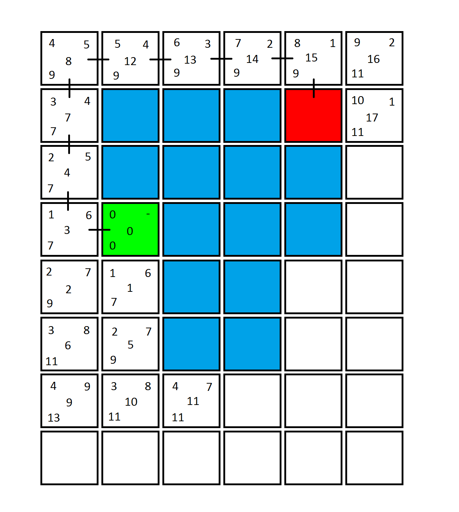

# Implementation of A* Useful Info

The A* algorithm must be provided with a grid, divided up into nodes. Each node must be equipped with previously provided information, dictating whether it is a start node, finish node, traversable or untraversable. Note that untraversable nodes are simply ones which cannot be crossed, since they might present a cause of collision, or because it is simply undesirable that they should be crossed. The algorithm initializes by analysing the surrounding nodes that are closest to the start node, i.e. by giving the selected nodes 3 scores which describe each node to an extent (Koenig et al., 2004). These scores are called the G, H and F scores. The G score denotes the amount of nodes which have been crossed from the start node, to the node that is being analysed at a point in time. The H score is a Heuristic, which is an estimation of the distance between the current node and the end node. Some types of Heuristic include Euclidian, Manhattan and Chebyshev (Ballard & Vacherand, 1993). The most simple of these 3 is the Manhattan heuristic, which simply counts the nodes in the x and y directions from the current node to the end node, and adds these values together. Finally, the F score of a node is the addition of the G and H score of that node, and can be represented visually as:
*   F(n) = G(n) + H(n)
*** 
After the nodes surrounding the start point are all analysed, the algorithm chooses one with the lowest F score and repeats this process at the new node. If the algorithm reaches a point where a previously analysed node had a lower F score than the one being analysed currently, that previously analysed node is returned to, and the process of analysing surrounding nodes is continued. This is repeated several times, and in this process all nodes are divided into two sets, these being the open and closed set. Nodes in the closed set have already been checked, and nodes in the open set are nodes that may be part of the final path from the start to end node. At each reiteration of this process of analysing nodes surrounding a central node, the central node is treated as the “parent” node of those surrounding nodes (Hart et al., 1968). Eventually, the algorithm will scan the surrounding nodes of a central node, and one of the nodes being analysed will be the finish node of the grid. At this point, the algorithm stops, and the “shortest path” is traced backwards from the end node to the start node, via the “parent nodes”.
***
Olha a figura:

Figure 1.1 presents a tile map which will be used as a primary example for the rest of this report. This map shows how each node is analysed, and how it’s G score (top left of tile), H score (top right of tile) and F score (bottom left of tile) are determined. The green, red and blue tiles represent the start node, end node and untraversable nodes respectively (Figure 1.1). The numbers in the centre of each node represent the order in which the nodes were analysed, and the black lines between nodes denote the path from the end point to the start point via the “parent nodes”. Therefore, for the example in figure 1.1, working back from the end point, the algorithm will create a path from start to finish through the nodes: 3, 4, 7, 8, 12, 13, 14 and 15.
***
