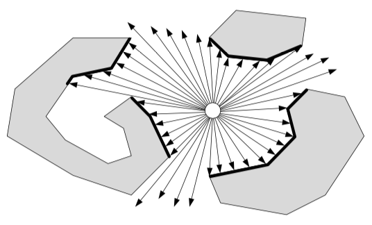
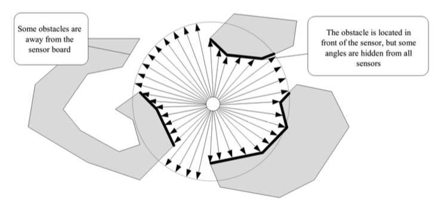
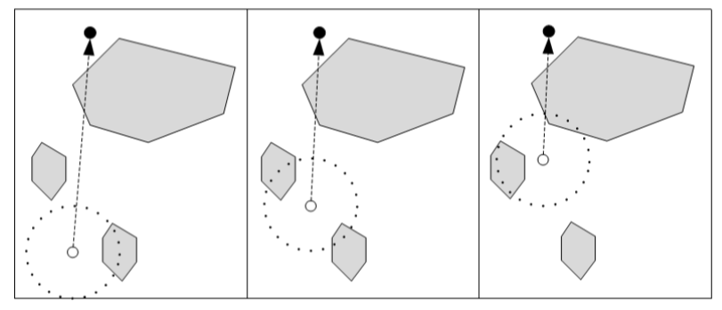
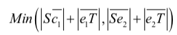
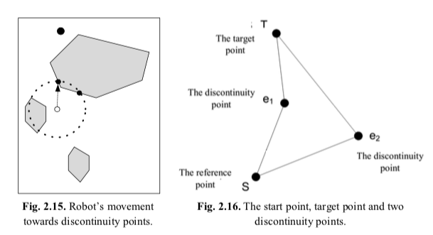

# The TangBug Algorithm

TangBug algorithm has been developed by Kamon, Rivlin and Rimon (Kamon et al. 1998). This algorithm incorporates distance-finding sensors to create a map of robot's surrounding environment and tries to minimize the path to the target. Suppose the robot has sensors that can determine the distance of obstacles around itself.

|  |
|:--:|
| *Fig. 2.12. Obstacle recognition with the help of sensors.* |

However, in practice, the robot's sensors don't scan all the angles to determine its distance to barriers continuously and perform it discretely. For example, the distance from the robot to a barrier is determined after each rotation by 5 degrees. However, in between these angle intervals, there may be t some obstacles that remain hidden from the robot's vision with this strategy. On one hand, these sensors may only cover a certain range, and if there be an obstacle
outside this range, the robot will not be able to recognize them.

|  |
|:--:|
| *Fig. 2.13. Obstacle recognition with the help of limited-range sensors.* |

|  |
|:--:|
| *Fig. 2.14. Robot’s straight movement towards the target before sensing the obstacle.* |

## TangBug works similar to Bug 2 algorithm:
* Step 0. 
Move towards the target until sensors sense an object between itself and the target directly.
* Step1.
After that,move towards discontinuity points of e1 or e2. The principle that robot meets to choose one of these two points, is shortening the path to the target. For example, in Fig. 2-15 the robot chooses its path based on this algorithm so that the amount  is achieved.

|  |
|:--:|
| *Fig. 2.15 Robot's movment towards discontinuity points. (Left)* |
| *Fig. 2.16. The start point, target point and two discontinuity points. (Right)* |
